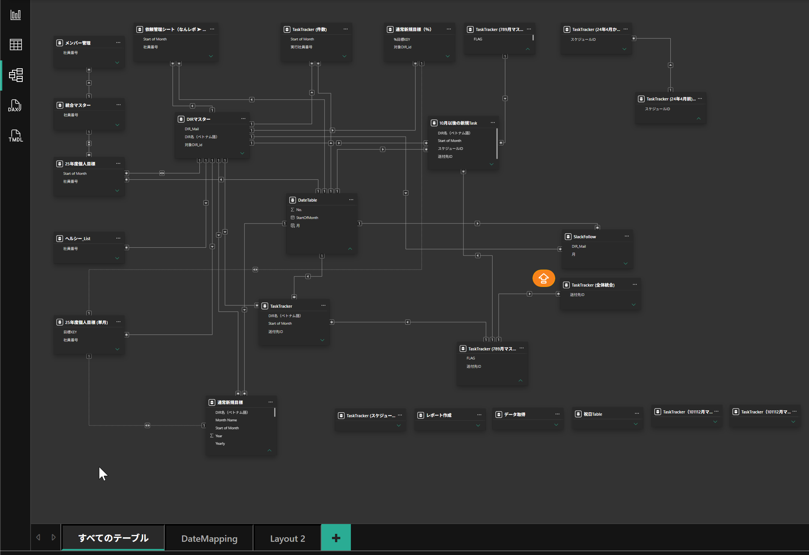
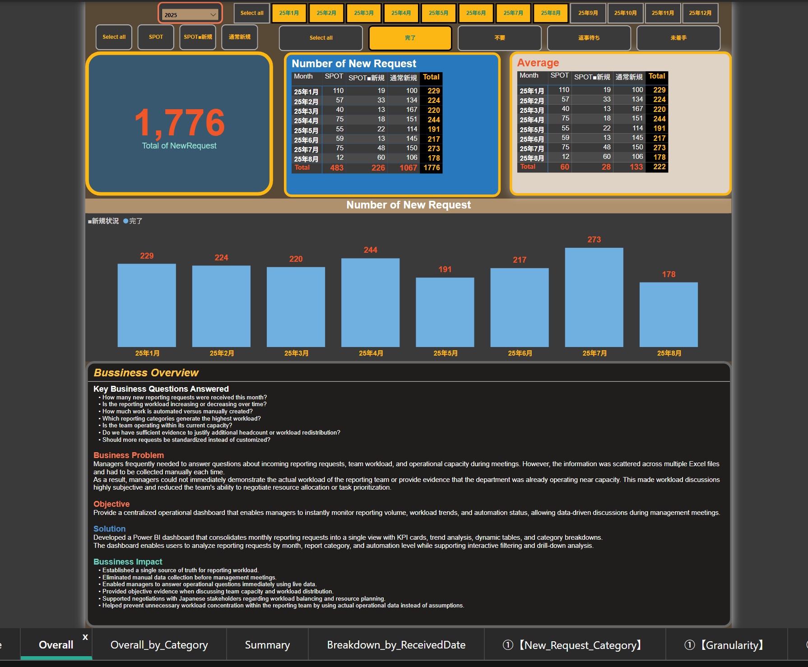
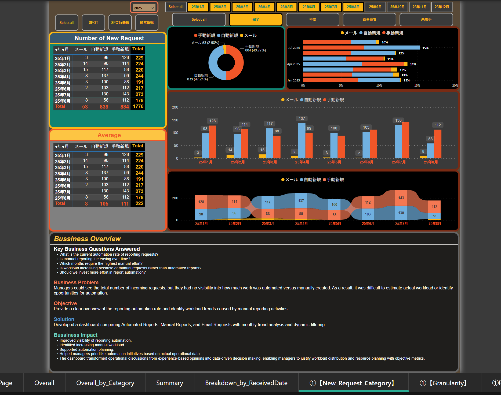
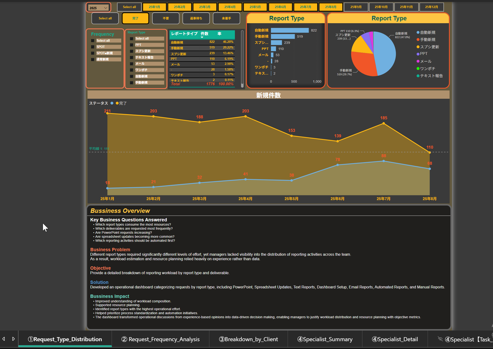
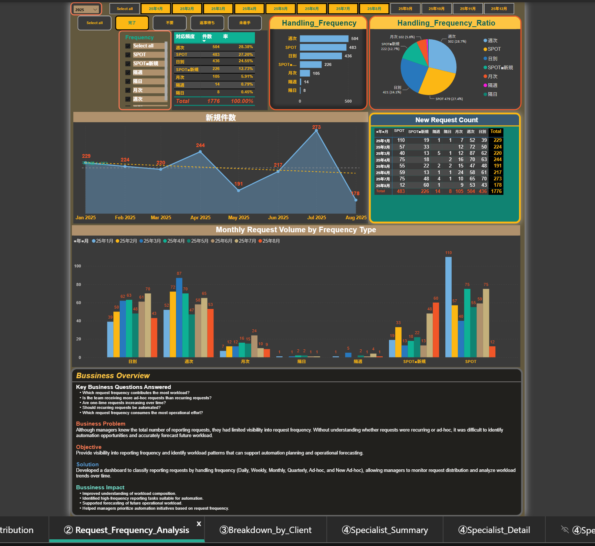
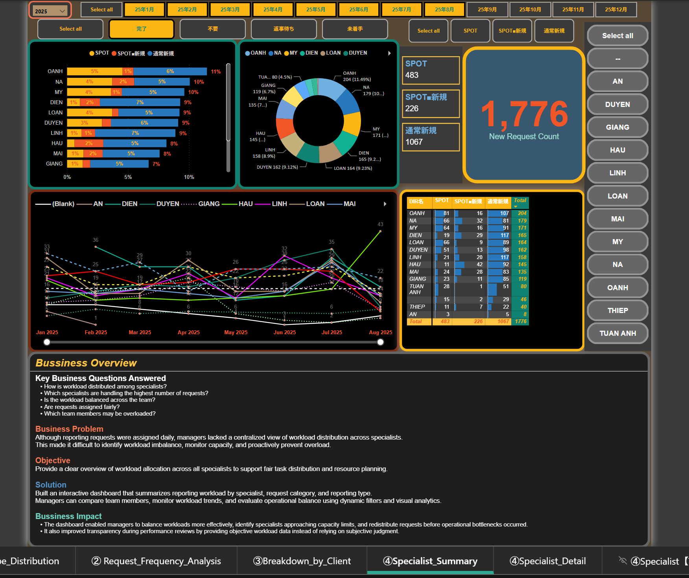
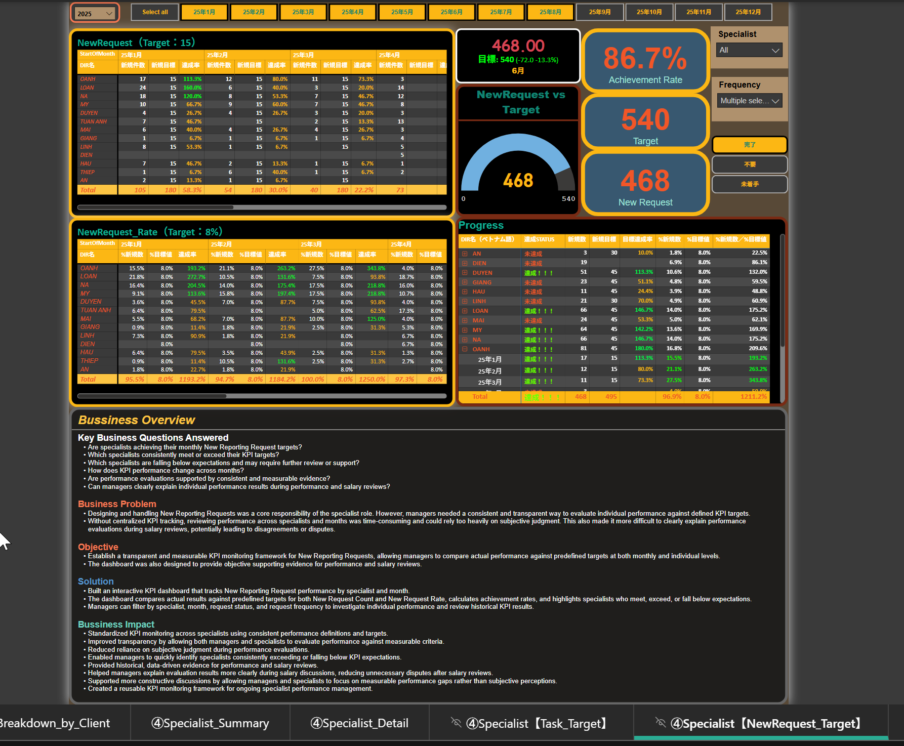
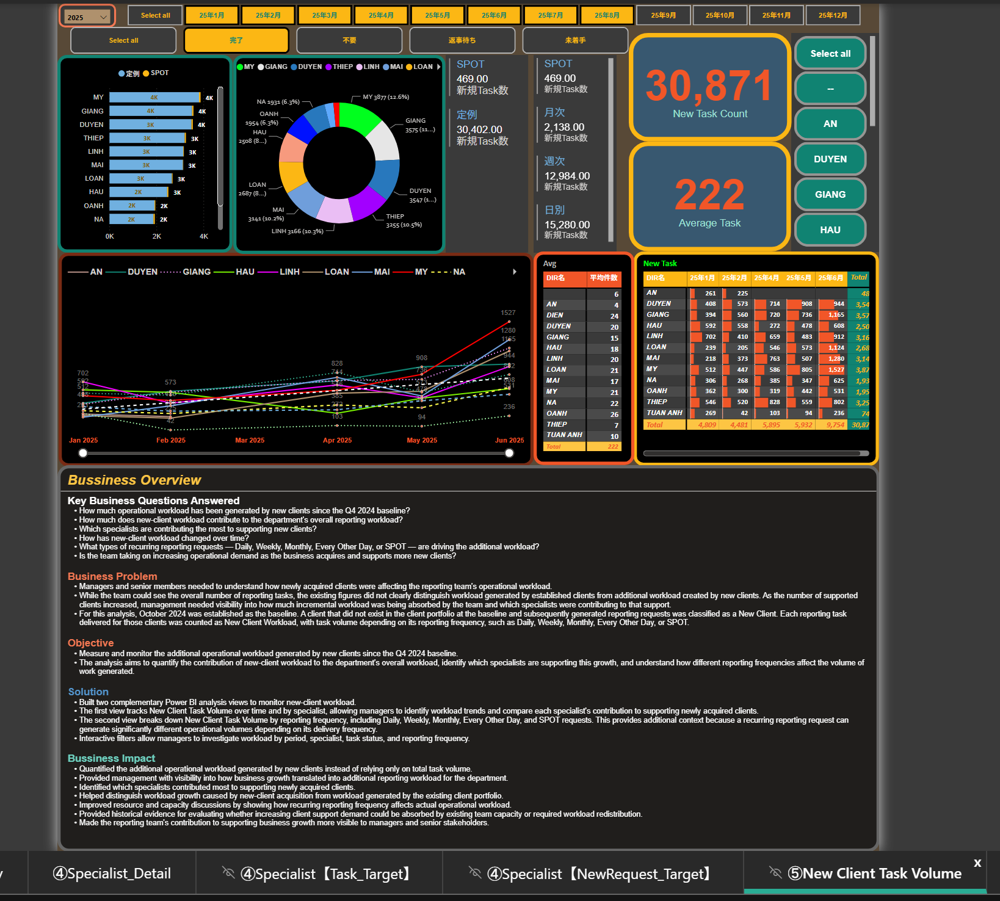
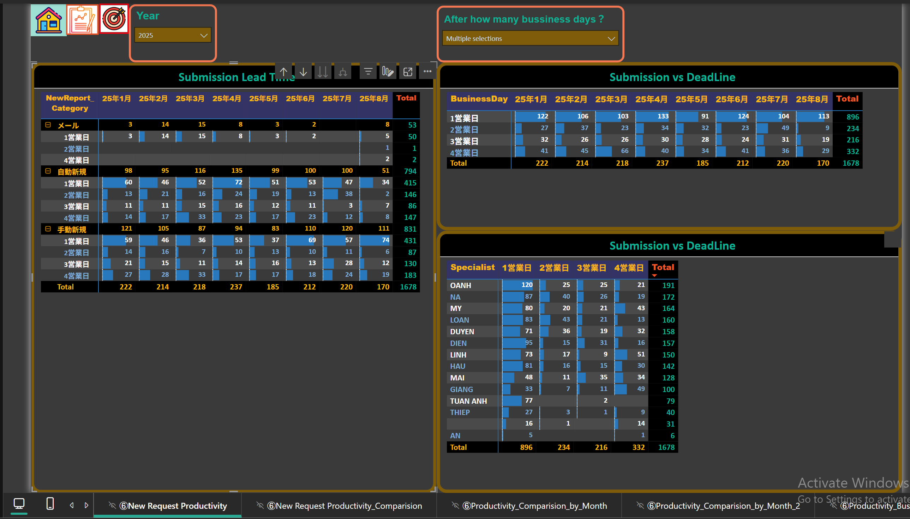
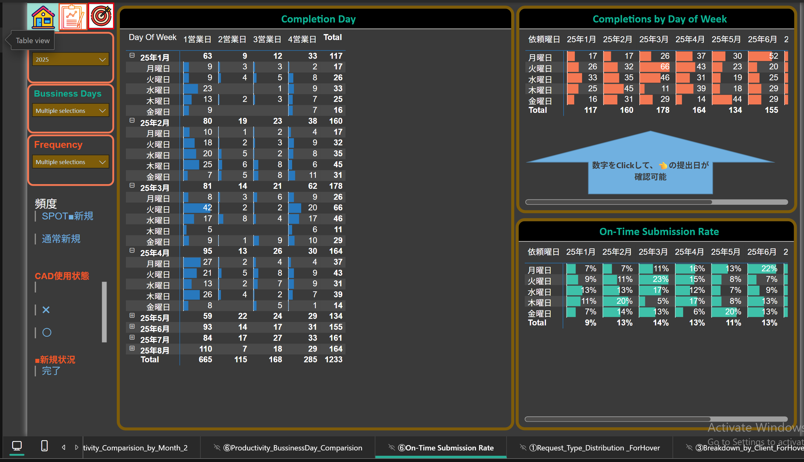

# Operational Management BI

## 1. Project Overview

I was the technical lead of a specialist team consisting of 11 members responsible for designing and maintaining reporting solutions for the Digital Marketing division of CyberAgent Japan.

The team specialized in designing new reporting solutions by integrating multiple digital marketing data sources and transforming business requirements into scalable reporting solutions.

Our responsibilities covered:

- Reporting solution design.
- Data integration from multiple media platforms.
- Data validation and quality checks.
- Report automation improvement.
- Operational handover and maintenance support.

After the department consolidated specialists from both manual reporting and automated reporting teams, I was responsible for selecting and developing the specialist team.

The goal was to combine different strengths:

### Manual Reporting Specialists

Manual reporting specialists had strong capability in handling highly customized reporting requirements, complex report structures, dynamic Excel layouts, and business-specific calculation logic.

Because each client requirement could have unique structures and reporting rules, they needed strong skills in:

- Raw data processing.
- Formula design.
- Master data management.
- Validation sheet creation.
- Flexible reporting layout design.

### Automation Reporting Specialists

Automation reporting specialists focused on scalable reporting solutions using in-house automation tools, configuration-based report generation, and reusable templates.

Automation reports were not simply generated by running macros. They required complex configuration management, including:

- Multi-level category settings.
- Report granularity configuration.
- Margin and cost calculation logic.
- Summary sheet generation rules.
- Daily report structures.
- Creative report management.
- Data mapping and validation settings.

By combining both skill sets, the team was able to design reporting solutions that were not only fast to deliver but also scalable and maintainable.

I coached team members not only on technical skills but also on:

- Problem-solving mindset.
- Proactive communication during requirement discussions.
- Proposal of improvement solutions.
- Providing clearer data-driven insights for sales and consulting teams.

As the team became a core operational function, management faced new challenges in workload visibility, resource planning, capacity forecasting, and KPI evaluation.

The department processed more than 200 new reporting requests monthly while maintaining existing reports.

Without centralized operational metrics, managers needed to manually collect updates from specialists, making workload management reactive and time-consuming.

To solve this challenge, I designed and developed an Operational Management BI solution to create a single source of truth for department operations.

---

# 2. Business Context

## Department Overview

The team was responsible for integrated reporting solutions across multiple digital marketing channels.

Unlike specialized teams focusing on a single platform such as SEM, YouTube, or App Advertising, our team handled reports requiring multiple media sources to be consolidated into one scalable and maintainable reporting solution.

The team received reporting requests from Japanese sales and consulting teams and transformed them into operational reporting solutions.

Our responsibilities included:

- Understanding reporting requirements.
- Designing reporting structures.
- Integrating multiple data sources.
- Creating validation logic and error detection mechanisms.
- Improving manual processes through automation.
- Supporting troubleshooting after report handover.

## Reporting Workflow

When a new reporting request was received:

1. Requirement clarification with stakeholders.
2. Data source investigation.
3. Report structure design.
4. Data transformation and calculation logic development.
5. Data validation and quality checking.
6. Automation opportunity evaluation.
7. Documentation and operational handover.

The team focused not only on completing requests quickly, but also on designing scalable solutions from the beginning.

Poorly designed manual reports could increase operational workload after handover. Therefore, automation potential and long-term maintainability were considered during the initial design phase.

---

# 3. Business Problem

The management team lacked a centralized view of operational performance.

Important questions could not be answered efficiently:

- How much workload is the team handling?
- Which specialists are overloaded?
- Are KPI targets realistic?
- How much additional workload comes from new clients?
- Is the team maintaining expected turnaround time?
- Which report types have automation potential?
- Are increasing workloads caused by business growth or inefficient manual processes?
- How should resources be allocated?

Previously, these questions required manual data collection from individual specialists, resulting in delayed and reactive decision-making.

The objective was not only to monitor workload volume,
but also to identify opportunities for process improvement and automation.

Because the reporting team was the entry point for new requests,
poor initial design decisions could create long-term operational costs.

Therefore, workload analysis was used to identify:
- Reports suitable for automation.
- Recurring manual processes.
- Standardization opportunities.
- Potential workload reduction initiatives.

---

# 4. Objectives

The objective was to build an operational BI solution that enables managers to:

- Monitor workload distribution.
- Evaluate specialist KPI achievement objectively.
- Track contribution from new clients.
- Measure operational productivity.
- Improve resource planning and capacity management.
- Identify automation opportunities.
- Support transparent performance and salary reviews.

---

# 5. Data & Technical Approach

## Data Pipeline

```text
Internal Shared Files
        |
        ↓
Python Data Ingestion
        |
        ↓
Local PostgreSQL Database
        |
        ↓
SQL Data Extraction & Filtering
        |
        ↓
Google Sheets Reference Data
        |
        ↓
Power Query ETL
        |
        ↓
Power BI Semantic Model
        |
        ↓
Operational Dashboard
```

## Data Modeling



The Power BI semantic model was developed to support operational
monitoring and management decision-making.

During the initial development phase, the primary focus was to solve
immediate operational challenges, including workload visibility,
specialist performance tracking, KPI monitoring, and productivity analysis.

Because business requirements evolved continuously and the solution was
built as an internal operational dashboard, the initial model prioritized
business usability and analytical flexibility over a fully standardized
enterprise data model.

The model currently combines:

- Operational transaction tables for reporting activities and workload tracking.
- Specialist master data for workload distribution and performance analysis.
- Target tables for KPI achievement comparison.
- Date dimensions for monthly and period-based analysis.
- Request category and frequency dimensions for operational breakdowns.
- Supporting reference tables for business rules and calculations.

With my current understanding of BI architecture and data modeling, I would
further improve the model by:

- Separating fact and dimension tables more explicitly.
- Reducing duplicated period-specific tables.
- Standardizing naming conventions and data definitions.
- Moving transformation logic into a dedicated data preparation layer.
- Creating a more maintainable semantic model for future expansion.

## Technical Implementation

-   Used Python to ingest and prepare internal operational data.
-   Stored processed data in PostgreSQL for easier querying and
    filtering.
-   Used SQL to extract required datasets from large operational data
    sources.
-   Used Google Sheets as additional reference/master data sources.
-   Used Power Query for data cleaning, transformation, mapping, and
    preparation.
-   Built Power BI semantic models, relationships, DAX measures, and
    dashboards.

------------------------------------------------------------------------

# 6. Dashboard & Analysis

## 6.1 Operational Overview



**Purpose:** Provide managers with a high-level view of reporting operations.

**Analyzes:**
- Total incoming requests.
- Monthly workload trend.
- Completion status.

**Business questions:**
- How much reporting demand is the team handling?
- Is workload increasing or decreasing?
- Is operational capacity sufficient?

---

## 6.2 Request Category Analysis



**Analyzes:**
- Automated new reporting requests.
- Manual new reporting requests.
- Email-based reporting requests.
- Monthly changes in the automation vs manual workload mix.
- Contribution of each request category to total incoming workload.

**Business questions:**
- What proportion of new reporting requests are automated versus manually created?
- Is manual reporting workload increasing over time?
- Which request category contributes the most operational effort?
- Is workload growth being driven more by manual requests than automated requests?
- Where should automation initiatives be prioritized to reduce long-term operational workload?

---

## 6.3 Report Type & Granularity Analysis



**Analyzes:**
- Report format.
- Deliverable type.
- Reporting granularity.
- Manual vs automated reporting activities.

**Examples:**
- PowerPoint reports.
- Spreadsheet updates.
- Automated reports.
- Manual reports.

**Business questions:**
- Which report types consume the most resources?
- Which activities have the highest automation potential?
- Where should improvement effort be invested?

---

## 6.4 New Report Request Frequency Analysis



**Analyzes:**
- Distribution of New Reporting Requests by handling frequency.
- Recurring requests such as Daily, Weekly, Monthly, and Every-other-day.
- Ad-hoc requests including SPOT and New SPOT requests.
- Monthly changes in request volume and frequency mix.
- Contribution of recurring and ad-hoc requests to operational workload.

**Business questions:**
- Which request frequencies contribute the most to operational workload?
- Is workload growth driven mainly by recurring or ad-hoc requests?
- Are recurring requests increasing over time and creating sustained workload?
- Which high-frequency recurring tasks are suitable candidates for automation?
- How can request frequency patterns support future workload and capacity planning?

---

## 6.5 Client Workload Analysis

> **Data Privacy Note:**  
> This analysis is included in the original Power BI dashboard but is not shown in this public portfolio because the visuals contain client-identifiable information. The underlying client names and related business information have been intentionally excluded to protect confidential data.

**Analyzes:**
- Workload contribution by client.
- Request volume by client.
- Operational demand generated by client portfolio.

**Business questions:**
- Which clients generate the highest operational demand?
- How does client growth affect team capacity?
- Where should resource allocation be adjusted?

---

## 6.6 Specialist Workload Analysis



**Analyzes:**
- Workload distribution across specialists.
- Monthly workload trend by specialist.
- Request composition by specialist.

**Business questions:**
- Is workload balanced across team members?
- Which specialists are approaching capacity limits?
- How should tasks be redistributed?

---

## 6.7 Specialist KPI Performance



**Analyzes:**
- New Reporting Request KPI achievement.
- Target vs actual performance.
- Monthly performance trends.
- Individual achievement rates.

**Business questions:**
- Are specialists achieving expected KPI targets?
- Which specialists consistently meet or exceed expectations?
- Can performance and salary reviews be supported with objective evidence?

---

## 6.8 New Client Workload Analysis



**Analyzes:**
- Additional workload generated by new clients since the Q4 2024 baseline.
- New-client workload contribution by specialist.
- Workload distribution by reporting frequency.

**Business questions:**
- How does business growth translate into additional operational workload?
- Which specialists contribute most to supporting new clients?
- Which reporting frequencies generate the highest recurring workload?

---

## 6.9 New Request Turnaround Analysis





**Analyzes:**
- Submission lead time.
- Business-day turnaround.
- Completion distribution within 1, 2, 3, or 4 business days.
- On-time submission rate.

**Business questions:**
- How quickly does the team respond to new requests?
- Is turnaround performance stable across months?
- Is operational productivity maintained despite changing workload?

---

# 7. Business Impact

The Operational Management BI solution created a single source of truth
for department operations.

Key impacts:

-   Created a centralized view of workload distribution, operational
    demand, and specialist contribution.
-   Enabled managers to identify workload imbalance by specialist and
    month, supporting more effective resource allocation decisions.
-   Established objective KPI tracking by comparing assigned targets
    with actual completed workload.
-   Supported fairer performance discussions and salary reviews using
    measurable operational evidence.
-   Reduced dependency on manual status collection from individual
    specialists.
-   Improved visibility into how business growth and new client requests
    affected team capacity.
-   Enabled managers to identify recurring workload patterns and
    prioritize automation opportunities.
-   Provided historical operational evidence for future capacity
    planning and process improvement initiatives.

------------------------------------------------------------------------

# 8. Limitations & What I Would Improve Today

This dashboard was originally developed as an internal operational
solution where the priority was rapid delivery and solving immediate
management problems.

Because requirements continuously evolved, the initial design focused on
practical problem-solving and fast delivery.

With my current BI and data modeling knowledge, I would improve the
architecture by:

-   Standardizing table and column naming conventions.
-   Separating operational, master, target, and helper tables more
    clearly.
-   Redesigning the analytical model with a clearer fact and dimension
    structure where appropriate.
-   Reducing duplicated or period-specific tables to improve
    maintainability.
-   Creating dedicated measure tables for DAX management.
-   Moving more transformation logic into a structured data layer.
-   Establishing stronger data governance and documentation.

The original solution successfully solved the operational challenges at
that time, while the redesigned approach would improve long-term
scalability and maintainability. \`\`\`
